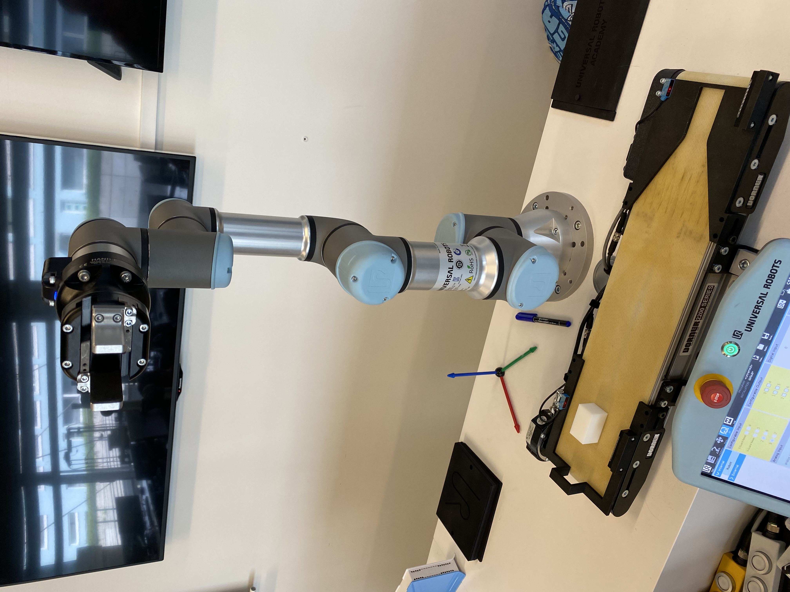

# robopilot

## Python example

The example shows abstraction on ur-rtde library and our GripperSocketControl library. It runs the conveyor, take piece from the conveyor end and put it at the beginning. Picture bellow shows initial state of the robot. If you want to run the example, you should set the robot to same state.

